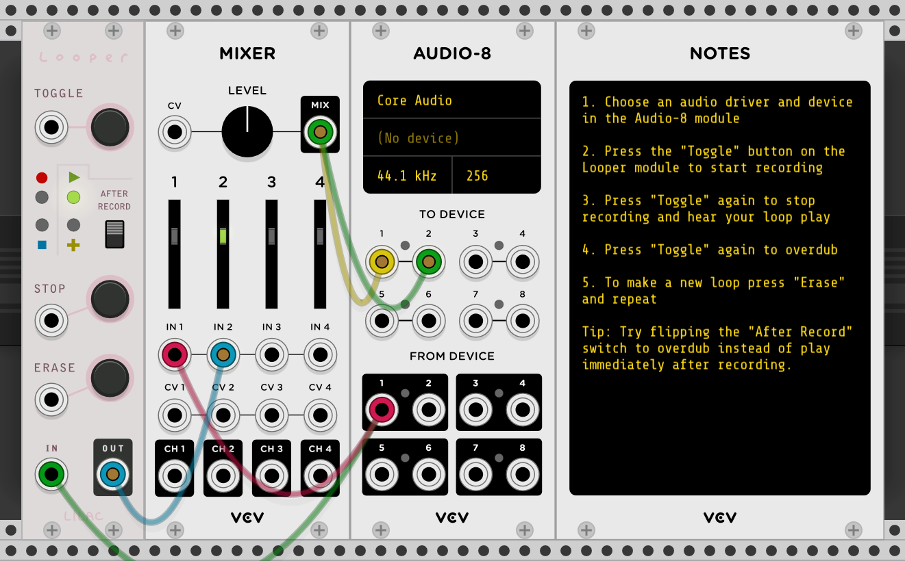

[Lilac Loop](https://library.vcvrack.com/LilacLoop) is a plugin for [VCV Rack](https://vcvrack.com/). As of [v1.0.0](https://github.com/grough/lilac-loop-vcv/releases/tag/v1.0.0) it contains just one module called _Looper_. If you'd like to report a bug or are having trouble using the plugin, please submit an [issue](https://github.com/grough/lilac-loop-vcv/issues).

## Module: _Looper_

The Looper module emulates the recording style of a simple [looper pedal](https://en.wikipedia.org/wiki/Live_looping). It allows you to record, play and overdub a mono or polyphonic signal using a multi-function "toggle" control comparable to the main foot switch on a looper pedal.

[](https://patchstorage.com/lilac-looper-mono-example/)

### Installation

To get started, [install the plugin](https://library.vcvrack.com/LilacLoop) and try one of the example patches:

- [Basic Looping](https://patchstorage.com/lilac-looper-mono-example/) (seen above)
- [Stereo looping](https://patchstorage.com/lilac-looper-stereo-example/)
- [Multi-track looping](https://patchstorage.com/lilac-looper-multi-track-example/)

A typical looping session might look like this:

```
Record → Play → Overdub → Play → Overdub → … → Stop → Play → … → Erase
```

### Interface & Controls

- **Toggle** is the main control that moves through the active stages of looping:
  - Record - create an initial recording, setting the duration of the loop
  - Overdub - mix new material into the loop
  - Play - continue listening to the loop without adding to it
- **Status lights** below the toggle control show the active mode; the light will blink when playback loops back to the beginning.
- Use the **After Record** switch to choose which mode is toggled after recording an initial loop. The "up" switch position will **play** immediately after recording; the "down" switch position will **overdub** instead.
- **Stop** will stop the loop if it's not already. Pressing _Toggle_ while stopped will restart the loop from the beginning.
- **Erase** removes a recorded loop from memory irreversibly allowing you to record a new loop. Looper doesn't actively prevent "pops" or "clicks" when erasing the loop (in contrast to other mode changes which are smooth and quiet). You can avoid "pops" by stopping the loop before erasing it.

### Stereo and Multi-Track Recording

Although Looper works in mono by default, it's capable of recording up to 16 tracks at once thanks to VCV Rack's [polyphonic cables](https://vcvrack.com/manual/Polyphony). To record a multi-channel loop, connect a polyphonic cable to the input and toggle _Record_ mode. Each channel on the polyphonic input will record to a dedicated internal channel and play back on the corresponding output channel. Use VCV's [Merge](https://library.vcvrack.com/Fundamental/Merge) and [Split](https://library.vcvrack.com/Fundamental/Split) modules to manage polyphony.

To record in **stereo**, simply use voices 1 & 2 of a polyphonic signal (as seen in the [stereo example](https://patchstorage.com/lilac-looper-stereo-example/)).

⚠️ Note that every input channel you plan to record must be connected before you start recording a new loop ([#3](https://github.com/grough/lilac-loop-vcv/issues/3)). Additional input channels connected after the first loop is recorded will be ignored until you erase and start a new recording.

### Input Monitoring

Looper doesn't mix its input signal with its output. If you want to hear live input along with a recorded loop, connect your live input and Looper's output into a mixer.

### Known Issues & Limitations

If you'd like to report a bug or are having trouble using the plugin, please submit an [issue](https://github.com/grough/lilac-loop-vcv/issues). Following are some known issues that may be solved in a future release:

- Number of polyphonic channels is constant per recording ([#3](https://github.com/grough/lilac-loop-vcv/issues/3))
- Erasing a loop during playback makes a "pop" or "click" sound
- Looper does not enforce a maximum loop length
