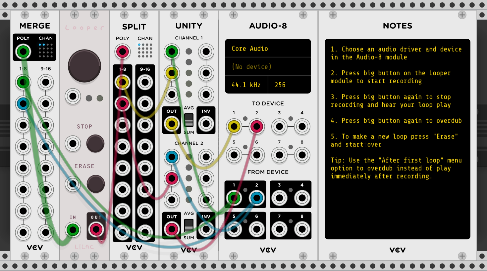

[Lilac Loop](https://library.vcvrack.com/LilacLoop) is a plugin for [VCV Rack](https://vcvrack.com/). As of [v1.0.2](https://github.com/grough/lilac-loop-vcv/releases/tag/v1.0.2) it contains just one module called _Looper_. If you'd like to report a bug or are having trouble using the plugin, please submit an [issue](https://github.com/grough/lilac-loop-vcv/issues).

## Module: _Looper_

The Looper module emulates the recording style of a [live looping pedal](https://en.wikipedia.org/wiki/Live_looping). It allows you to record, play and overdub a mono, stereo, or polyphonic signal using a multi-function toggle control comparable to the main foot switch on a looper pedal.

[](https://patchstorage.com/lilac-looper-stereo-example/)

### Get Started

[Install the plugin](https://library.vcvrack.com/LilacLoop) and try one of the example patches:

- [Stereo looping](https://patchstorage.com/lilac-looper-stereo-example/) (seen above)
- [Mono Looping](https://patchstorage.com/lilac-looper-mono-example/)
- [Polyphonic looping](https://patchstorage.com/lilac-looper-multi-track-example/)

Press the big button to toggle between record, play and overdub modes. A typical looping session might look like this:

```
Record → Play → Overdub → Play → Overdub → … → Stop → Play → … → Erase
```

### Interface & Controls

- **Toggle** is the big button that moves through the active stages of looping:
  - Record - create a first recording, setting the duration of the loop
  - Play - listen to the loop without adding to it
  - Overdub - add new material into the loop while playing
- **Status lights** below the big button show when you're recording (red) and playing (green); The light blinks every time Looper reaches the starting point of the loop.
- **Stop** stops the loop. Pressing toggle while stopped will restart the loop from the beginning.
- **Erase** removes a recorded loop from memory irreversibly allowing you to record a new loop. Looper doesn't actively prevent "pops" or "clicks" when erasing the loop (in contrast to other mode changes which are smooth and quiet). You can avoid "pops" by stopping the loop before erasing it.
- **Mix** changes the balance between your live input signal and the recorded loop
- Use the "**After first loop…**" option in the module's context menu to choose which mode is toggled after recording your first loop. The default setting is "Play". The "Overdub" setting will continue recording after recording your first loop

### Multi-Track Recording

Looper's stereo inputs and outputs are [polyphonic](https://vcvrack.com/manual/Polyphony), meaning you can record up to 32 tracks in total (left and right, 16 channels each). Connect a polyphonic cable to an input and press the big toggle button to start recording. Each channel of polyphony on the input will record on a separate internal track and play back on the corresponding output channel. Use VCV's [Merge](https://library.vcvrack.com/Fundamental/Merge) and [Split](https://library.vcvrack.com/Fundamental/Split) modules to manage polyphony.

### Known Issues & Limitations

If you'd like to report a bug or are having trouble using the plugin, please submit an [issue](https://github.com/grough/lilac-loop-vcv/issues). Following are some known issues that may be solved in a future release:

- Erasing a loop during playback makes a "pop" or "click" sound
- Looper does not enforce a maximum loop length
